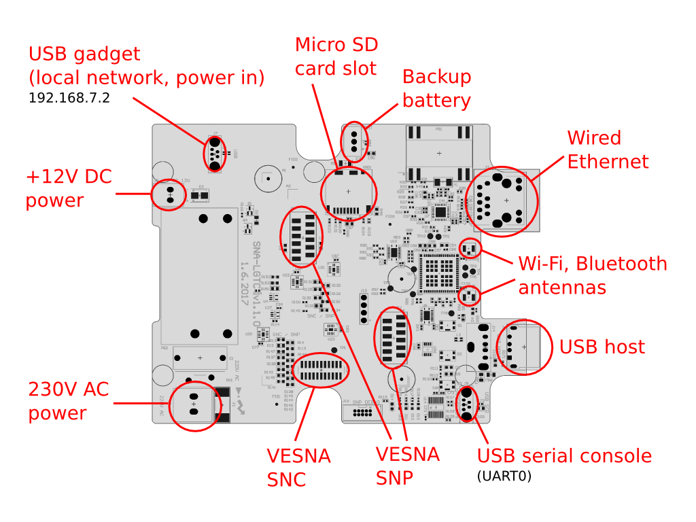
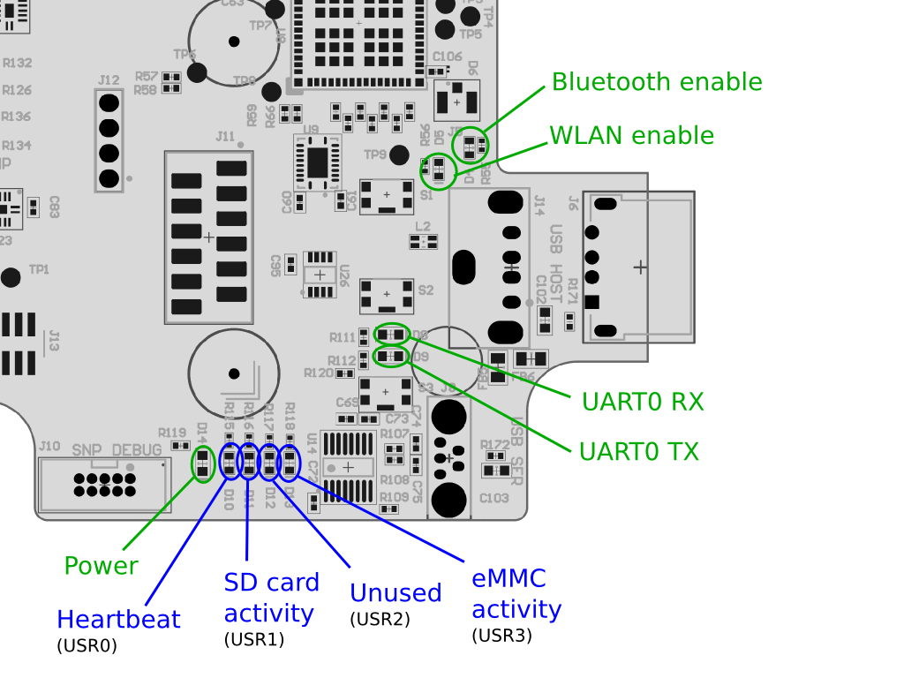

# SNA-LGTC

SNA-LGTC is a small, ARM-based Linux-running computer that is capable of hosting
microcontroller-based boards such as VESNA SNC and VESNA SNP. This repository
contains various small software parts and documentarion related to
SNA-LGTC:

 * `dts` - Device tree source and compiled device tree blobs.
 * `docker` - Configuration for Docker.
 * `figures` - Photos and other figures related to the SNA-LGTC board.

It also contains sources for several Debian packages that need to be installed
on SNA-LGTC boards:

 * `bb-wl18xx-firmware` - Customized WL1837 firmware and related scripts.
 * `sna-lgtc-boot` - First boot setup scripts for setting up hostname, machine
   ID, etc.
 * `vesna-snc-boot` - Systemd service that boots the VESNA SNC guest board
   after the host boots.
 * `videk-client` - Client for the Videk management system.

Related repositories and documents in other places:

 * [Schematic and PCB layout](https://github.com/urbangregorc/vesna-hardware/tree/SNA-LGTC/SNA-LGTC/v1.1.0) for the SNA-LGTC board.
 * [Patched OpenOCD](https://github.com/avian2/openocd/tree/sna-lgtc) for programming the guest VESNA SNC board.
 * [Instructions](https://github.com/avian2/vesna-drivers/blob/logatec-3/README.beaglebone.md)
   for compiling, uploading and debugging firmware for the guest VESNA SNC
   board using *vesna-drivers* from the host SNA-LGTC board.
 * [NodeSpectrumSensorLocal](https://github.com/avian2/vesna-drivers/tree/logatec-3/Applications/Logatec/NodeSpectrumSensorLocal), application for controlling the SNE-ISMTV radio on the guest board using ALH protocol over the UART.
 * [VESNA management system](https://github.com/matevzv/vesna-management-system), web application for remote access over ALH to the guest VESNA SNC.
 * [Boot scripts](https://github.com/avian2/bone-boot-scripts/tree/sna-lgtc), customized BeagleBone boot scripts for SNA-LGTC.

## Connectors

The board will boot when one of the connectors providing power supply is
connected (230V AC, 12V DC or the 5V supply from the USB gadget).

To start, connect mini-USB cable to the USB gadget connector, bring up the USB
network interface using DHCP and log in to 192.168.7.2 over *ssh*.

## LEDs

In normal operation, green power LED should be lit and the blue heartbeat LED
should be blinking periodically.

