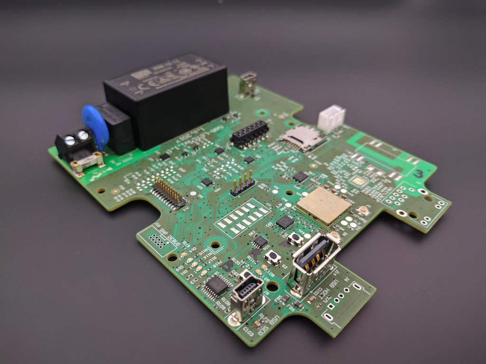

# SNA-LGTC

SNA-LGTC is a small, ARM-based Linux-running computer that is capable of hosting
microcontroller-based boards such as VESNA SNC and VESNA SNP. This repository
contains various small software parts and documentarion related to
SNA-LGTC:

 * `dts` - Device tree source.
 * `dtb` - Compiled device tree blobs.
 * `vesna-snc-boot` - Debian package with a systemd service that boots the VESNA
   SNC guest board after the host boots.
 * `wlconf` - Configuration for the TI WL1837 wi-fi module.
 * `bluetooth` - Using Bluetooth on WL1837.
 * `docker` - Configuration for Docker.
 * `figures` - Photos and other figures related to the SNA-LGTC board.

Other related repositories and documents:

 * [Schematic and PCB layout](https://github.com/urbangregorc/vesna-hardware/tree/SNA-LGTC/SNA-LGTC/v1.1.0) for the SNA-LGTC board.
 * [Patched OpenOCD](https://github.com/avian2/openocd/tree/bbblack) for programming the guest VESNA SNC board.
 * [Instructions](https://github.com/avian2/vesna-drivers/blob/logatec-3/README.beaglebone.md)
   for compiling, uploading and debugging firmware for the guest VESNA SNC
   board using *vesna-drivers* from the host SNA-LGTC board.
